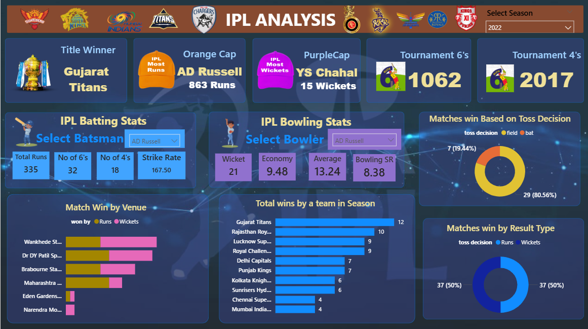

# 🏏 IPL 2008 to 2022 Data Analysis Dashboard

This repository contains an interactive and comprehensive **IPL 2008 to 2022 Data Analysis** project built to showcase data analytics skills using real cricket data. The project dives deep into player performance, team statistics, match outcomes, and venue analysis through compelling visualizations and insights.

---

## 📌 About the Project

The Indian Premier League (IPL) is one of the most data-rich sporting events globally. Analyzing IPL data provides an excellent opportunity to practice data wrangling, statistical evaluation, and interactive storytelling.

This project is focused on:
- Understanding overall trends from the IPL season from 2008 to 2022.
- Highlighting top-performing players and teams.
- Creating an interactive dashboard to explore insights with ease.

> 🎯 **Goal**: Present actionable insights from IPL 2008 to 2022 in a visually engaging and data-driven format using Power BI.

---
## 📸 Dashboard Preview

--- 

## 🧠 Skills Showcased

✅ Data Cleaning & Preprocessing  
✅ Data Aggregation & Transformation  
✅ KPI Design & Visualization  
✅ Use of Calculated Fields and Measures  
✅ Dashboard Designing in Power BI  
✅ Storytelling Through Data  
✅ Performance Comparison & Trends  

---

## 🖥️ Tools & Technologies Used

| Tool/Tech        | Purpose                                 |
|------------------|-----------------------------------------|
| **Power BI**     | Dashboard creation & visual analytics   |
| **Excel/CSV**    | Raw data handling & formatting          |
| **DAX**          | Custom measures and calculated columns  |
| ** Python** | Data cleaning /preprocessing (Pandas) |

---

## 📊 Dashboard Highlights

### 🏆 Summary Cards
- **Champion**: 
- **Orange Cap (Most Runs)**: 
- **Purple Cap (Most Wickets)**: 
- **Total Sixes**: 
- **Total Fours**: 

---

### 📈 Player Performance

#### (Batting):
- Runs: 
- Strike Rate: 
- Sixes:   
- Fours: 

#### (Bowling):
- Wickets:   
- Economy:  
- Bowling Avg:   
- Bowling SR: 

---

### 🏟️ Team & Match Insights

- **Match Wins by Venue**: Tracks performance across Wankhede, DY Patil, Eden Gardens, etc.
- **Win Based on Toss**:
  - Field First: 
  - Bat First: 
- **Win by Result Type**:
  - Wins by Runs: 
  - Wins by Wickets: 
- **Most Successful Team**:
  - Gujarat Titans: 
  - Rajasthan Royals: 
  - LSG: 

---

